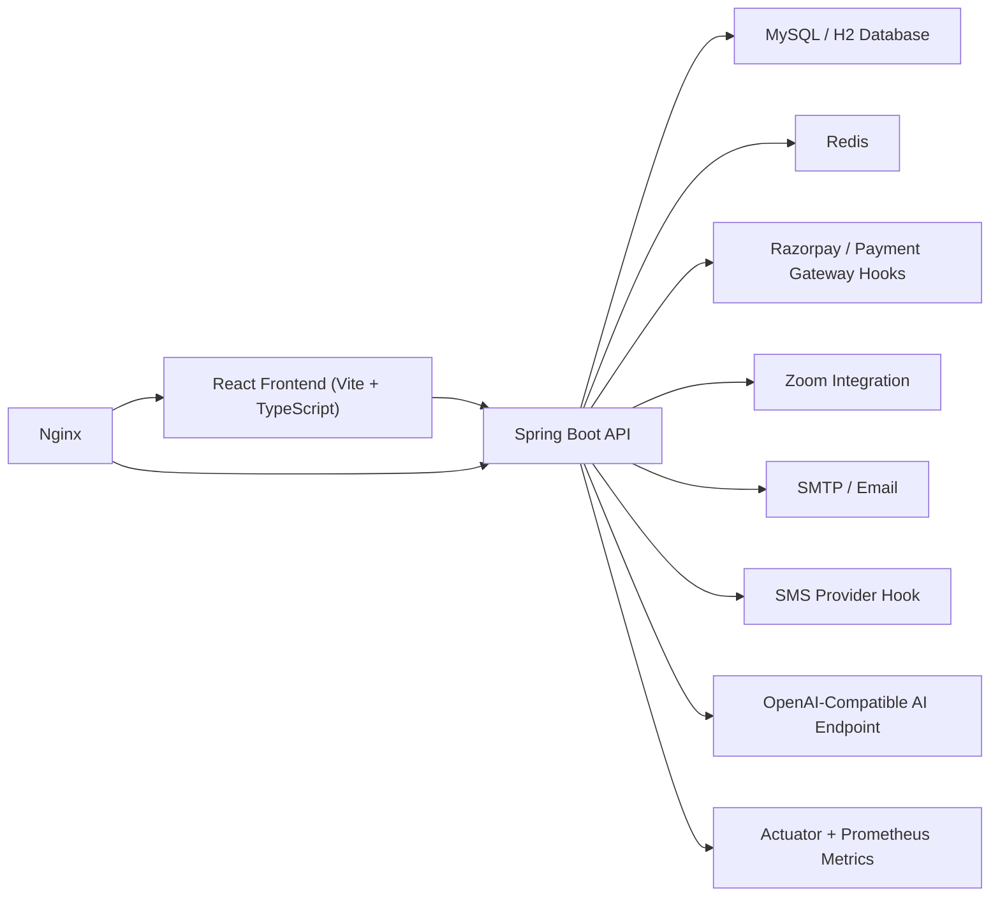

# MindBridge Health Platform

Comprehensive Project Documentation

## 1. Executive Summary

MindBridge Health Platform is a full-stack mental health SaaS application designed to help users move from early symptom awareness to therapist engagement, payment, and session follow-up in one system. The platform combines AI-assisted structured screening, therapist discovery, booking orchestration, digital payments, virtual session support, moderation workflows, and operational monitoring.

The project is built as a role-based platform with three primary actors:

- `USER`: completes assessments, tracks mood, finds therapists, books sessions, pays for care, and requests refunds.
- `THERAPIST`: manages profile data, uploads verification documents, publishes availability, reviews session-related information, and receives earnings/payouts.
- `ADMIN`: verifies therapists, oversees platform operations, moderates reviews, manages payouts and refunds, and monitors platform behavior.

The current implementation uses:

- React 19 + Vite + TypeScript for the frontend
- Spring Boot 3.4 + Java 21 for the backend
- MySQL or H2 for persistence
- Redis for slot-locking and concurrency-sensitive booking operations
- Razorpay-style payment orchestration, Stripe-style placeholder flow, and cash confirmation support
- Zoom integration hooks for virtual sessions
- Actuator + Prometheus-compatible metrics for observability

This project is structured as a production-oriented SaaS foundation rather than a single-feature demo.

## 2. Product Vision and Problem Statement

Mental health support systems often fail users in three common ways:

- screening is disconnected from care access
- booking and payment are handled in separate tools
- follow-up is reactive rather than measurement-based

MindBridge addresses those gaps by linking triage, therapist discovery, scheduling, payment, session support, and post-session tracking inside one platform.

The system is intended to solve practical problems seen in real-world digital care products:

- users need low-friction access to care after an assessment
- elevated-risk users need better guidance than a generic score
- therapist marketplaces need verification, scheduling, and payment traceability
- admins need operational oversight for safety, fraud risk, and platform quality
- payment and refund flows need transparent, user-friendly visibility

## 3. Industry and Research Foundations

The product direction aligns with several real-world care and platform design patterns:

### 3.1 Measurement-Based Care

The platform uses PHQ-9 and GAD-7 style screening plus ongoing mood tracking to support measurement-based care rather than relying only on memory or one-time narrative descriptions. This matters because symptom scoring over time gives a clearer picture of trajectory and can improve follow-up decisions.

Relevant references:

- [PubMed: Measurement-based care RCT in depression](https://pubmed.ncbi.nlm.nih.gov/26315978/)
- [PubMed: Recent depression care outcome trial](https://pubmed.ncbi.nlm.nih.gov/40892412/)

### 3.2 Safety Planning and Crisis Support

High-risk or emergency-like responses require action-oriented guidance, not only severity labels. The platform therefore surfaces warning signs, coping steps, and support options when elevated risk is detected.

Relevant references:

- [988 Lifeline - Help Yourself](https://988lifeline.org/help-yourself/)
- [988 Lifeline - What to Expect](https://988lifeline.org/get-help/what-to-expect/)

### 3.3 Price Transparency and Payment Clarity

Healthcare and care-adjacent systems increasingly need user-friendly cost visibility. The platform’s payment quote and refund-eligibility improvements were designed around the idea that users should understand expected charges and refundable balance before taking action.

Relevant references:

- [CMS Hospital Price Transparency](https://www.cms.gov/priorities/key-initiatives/hospital-price-transparency)
- [CMS Consumer Transparency Guidance](https://www.cms.gov/priorities/key-initiatives/hospital-price-transparency/consumers)

## 4. Core Product Capabilities

### 4.1 User Capabilities

- sign up and sign in with JWT-based authentication
- refresh access tokens with refresh-token flow
- complete AI-assisted structured mental health assessments
- accept an AI triage disclaimer before assessment use
- record daily mood check-ins and review mood trends
- browse therapist directory with search and filters
- view therapist availability and create bookings
- reschedule or cancel bookings under platform rules
- confirm session payments
- download invoices
- download session calendar invites
- submit therapist reviews
- request refunds
- access a dashboard with care insights, session visibility, and payment summary

### 4.2 Therapist Capabilities

- register as therapist
- maintain therapist profile and language/bio data
- upload identity and licensing documents
- manage availability slots
- review session list and meeting information
- access therapist-facing AI summaries
- request payouts
- manage session meeting links

### 4.3 Admin Capabilities

- review pending therapists
- verify or reject therapists
- inspect therapist operational overview
- moderate reviews
- process refunds
- mark therapist payouts as paid
- access role-protected admin dashboards and platform controls

## 5. Updated Improvements in This Version

This documentation reflects the recent refactor and functionality upgrade completed in the current codebase.

### 5.1 Dashboard Intelligence

The user dashboard is no longer a placeholder endpoint. It now aggregates:

- booking metrics
- next active session
- care insights
- recommended next steps
- payment overview
- mood trend context

This makes the dashboard useful as an operational home screen rather than a simple session list.

### 5.2 Safer Structured Assessment Logic

The AI screening flow now:

- treats PHQ-9 item 9 as a higher-risk signal
- exposes actionable care recommendations
- returns a safety-plan template for elevated risk
- supports measurement-based follow-up guidance tied to mood trends

This is a meaningful safety improvement over a score-only workflow.

### 5.3 Better Payment and Refund UX

The payment system now exposes:

- booking-level payment quotes
- payment overview metrics
- refund-eligible bookings
- remaining refundable balance per transaction

This avoids the previous pattern where users had to manually type booking IDs and guess refund values.

## 6. End-to-End Functional Flows

### 6.1 User Journey

1. User signs up or signs in.
2. User completes a structured assessment.
3. Platform computes PHQ-9/GAD-7 scores and risk level.
4. User receives triage guidance and can continue mood tracking.
5. User browses therapists and checks real availability.
6. User creates a booking, which enters `PENDING`.
7. User completes payment or confirms cash payment.
8. Booking moves to `CONFIRMED` and a meeting link can be attached.
9. Session is completed, cancelled, rescheduled, or marked no-show.
10. User reviews therapist, downloads invoice/calendar invite, and may request a refund where eligible.

### 6.2 Therapist Journey

1. Therapist signs up.
2. Therapist profile is created with role `THERAPIST`.
3. Therapist uploads documents and profile data.
4. Admin verifies or rejects the therapist.
5. Therapist publishes available slots.
6. Bookings are created against those slots.
7. Therapist manages sessions and payout requests.

### 6.3 Admin Journey

1. Admin reviews pending therapist accounts.
2. Admin verifies therapist identities/documents.
3. Admin monitors therapist overview and booking activity.
4. Admin processes refunds and payouts.
5. Admin can inspect review moderation and operational status.

## 7. System Architecture



### 7.1 Frontend

Frontend responsibilities:

- role-based routing
- protected page access via role guards
- user workflows for booking, triage, dashboard, and payments
- therapist/admin-facing UI screens
- HTTP communication with backend APIs
- visual session/payment/care summaries

Key frontend routes include:

- `/`
- `/login`
- `/signup`
- `/therapist-signup`
- `/triage`
- `/therapists`
- `/dashboard`
- `/predict`
- `/payments`
- `/therapist`
- `/admin`

### 7.2 Backend

Backend responsibilities:

- authentication and authorization
- business rules and workflow orchestration
- persistence and entity lifecycle
- AI triage scoring and care insight generation
- booking/payment/refund/payout operations
- therapist verification workflow
- session and notification operations
- observability and request controls

### 7.3 Infrastructure

- `MySQL`: primary production-style relational database
- `H2`: local/dev fallback database
- `Redis`: locking support for booking slot contention
- `Nginx`: reverse proxy in Dockerized deployment
- `Prometheus`: monitoring integration via exposed metrics endpoint

## 8. Repository Structure

```text
mental-health-AI-payments/
├── src/                               # React frontend
│   ├── components/
│   ├── lib/
│   └── pages/
├── backend/                           # Spring Boot backend
│   ├── src/main/java/com/mentalhealth/app/
│   │   ├── admin/
│   │   ├── ai/
│   │   ├── audit/
│   │   ├── auth/
│   │   ├── booking/
│   │   ├── common/
│   │   ├── config/
│   │   ├── dashboard/
│   │   ├── notification/
│   │   ├── payment/
│   │   ├── review/
│   │   ├── security/
│   │   ├── therapist/
│   │   ├── user/
│   │   └── video/
│   ├── src/main/resources/
│   └── Dockerfile
├── ops/
├── docs/
├── Dockerfile.frontend
├── README.md
└── package.json
```

## 9. Frontend Module Overview

### 9.1 `src/pages/Home.tsx`

Landing page introducing the care journey and directing users to triage, therapist discovery, or role-specific dashboards.

### 9.2 `src/pages/TriageChat.tsx`

Assessment and mood-tracking interface. Handles:

- structured question flow
- disclaimer acceptance
- assessment submission
- risk/result rendering
- care insight display
- safety-plan presentation for elevated risk
- mood check-in history

### 9.3 `src/pages/Therapists.tsx`

Therapist search and slot-booking page. Handles:

- therapist filtering by keyword, specialization, language, rating, and price
- therapist selection
- slot retrieval
- booking creation

### 9.4 `src/pages/Dashboard.tsx`

Primary user operations hub. Handles:

- booking status display
- rescheduling and cancellation
- calendar invite downloads
- review submission
- quote-based cash confirmation
- care insight and mood trend display
- next-step recommendations

### 9.5 `src/pages/Payments.tsx`

Payment operations page. Handles:

- transaction history
- payment overview metrics
- invoice download
- refund-eligible booking selection
- refund request submission
- refund status display

### 9.6 Role-Based UI

Other pages support:

- therapist sessions
- admin dashboard
- login/signup
- prediction flow

## 10. Backend Module Overview

### 10.1 Authentication Module

Package: `backend/src/main/java/com/mentalhealth/app/auth`

Responsibilities:

- user sign-in
- user signup
- therapist signup
- refresh token flow

Key controller:

- `AuthController`

### 10.2 Security Module

Package: `backend/src/main/java/com/mentalhealth/app/security`

Responsibilities:

- JWT validation
- request logging
- login rate limiting
- general rate-limiting support
- role-based endpoint protection
- password hashing with BCrypt
- CORS/security header configuration

### 10.3 AI Module

Package: `backend/src/main/java/com/mentalhealth/app/ai`

Responsibilities:

- assessment lifecycle
- structured PHQ-9/GAD-7 question serving
- score calculation
- risk classification
- mood check-in tracking
- therapist-facing summaries
- care insight generation
- optional chat-based AI interaction

Important entities:

- `AiAssessment`
- `AiChatMessage`
- `MoodCheckin`

### 10.4 Therapist Module

Package: `backend/src/main/java/com/mentalhealth/app/therapist`

Responsibilities:

- therapist profile creation and update
- document management
- availability publishing
- therapist search
- therapist approval status handling

Important entities:

- `Therapist`
- `TherapistProfile`
- `TherapistAvailability`

### 10.5 Booking Module

Package: `backend/src/main/java/com/mentalhealth/app/booking`

Responsibilities:

- booking creation
- booking confirmation after payment
- rescheduling
- cancellation
- completion/no-show status updates
- session calendar invite generation

Important entity:

- `Booking`

### 10.6 Payment Module

Package: `backend/src/main/java/com/mentalhealth/app/payment`

Responsibilities:

- payment order creation
- payment verification
- cash payment confirmation
- invoice generation
- refund request handling
- payout request handling
- payment history and overview
- payment quote calculation

Important entities:

- `PaymentTransaction`
- `Refund`
- `Payout`

### 10.7 Review Module

Package: `backend/src/main/java/com/mentalhealth/app/review`

Responsibilities:

- review submission
- moderation flow

### 10.8 Notification Module

Package: `backend/src/main/java/com/mentalhealth/app/notification`

Responsibilities:

- email notifications
- SMS hook
- in-app notifications
- reminder scheduling

### 10.9 Video Module

Package: `backend/src/main/java/com/mentalhealth/app/video`

Responsibilities:

- meeting metadata persistence
- Zoom integration support
- meeting attendance status tracking

### 10.10 Admin Module

Package: `backend/src/main/java/com/mentalhealth/app/admin`

Responsibilities:

- therapist verification/rejection
- therapist operational overview
- platform supervision functions

## 11. Authentication and Authorization

The platform uses stateless JWT-based authentication.

### 11.1 Authentication Flow

1. User submits credentials to `/api/auth/signin`.
2. Backend authenticates with Spring Security.
3. Access token and refresh token are issued.
4. Frontend stores tokens and attaches the access token on authenticated requests.
5. Expired access tokens can be refreshed through `/api/auth/refresh`.

### 11.2 Roles

- `USER`
- `THERAPIST`
- `ADMIN`

### 11.3 Security Controls

The backend includes:

- BCrypt password hashing
- JWT validation filter
- login rate-limiting filter
- request logging filter
- stateless session policy
- CSP and HSTS header configuration
- method-level role protection using `@PreAuthorize`

Public endpoints include:

- `/api/auth/**`
- `/api/public/**`
- payment webhook paths
- therapist discovery and public profile/slot endpoints
- selected Actuator and Swagger endpoints

## 12. AI Assessment and Care Logic

### 12.1 Structured Tools

The system supports:

- `PHQ9`
- `GAD7`
- `COMBINED`

### 12.2 Risk Classification

Assessment scoring derives:

- PHQ-9 score
- GAD-7 score
- overall risk level
- summary narrative

The updated logic gives additional importance to PHQ-9 item 9 responses because self-harm-related answers should escalate care handling beyond simple score thresholds.

### 12.3 Mood Tracking

Users can submit a 1-10 mood score with an optional note. The system calculates:

- average mood
- min/max mood
- number of entries
- recent history

### 12.4 Care Insights

The new care-insights layer provides:

- latest assessment snapshot
- recommended actions
- safety-plan template
- measurement-based care guidance
- follow-up cadence suggestion

### 12.5 AI Limitations

The AI functions in this project are triage-oriented only. They are not designed to diagnose, prescribe, or replace qualified clinical care.

## 13. Therapist Discovery and Booking

### 13.1 Therapist Search

Users can filter therapists by:

- specialization
- keyword
- language
- minimum rating
- maximum price
- availability after a given time

### 13.2 Availability Management

Therapists can:

- create availability slots
- update existing slots
- retrieve their current schedule

### 13.3 Slot Locking

To reduce double-booking risk, the backend uses Redis-based slot locking during booking creation. This is important for concurrency safety when multiple users attempt to reserve the same therapist slot.

### 13.4 Booking Statuses

The booking lifecycle includes:

- `PENDING`
- `CONFIRMED`
- `CANCELLED`
- `COMPLETED`
- `NO_SHOW`

### 13.5 Reschedule and Cancellation Rules

- users can reschedule their own active bookings
- therapists can reschedule their own sessions
- rescheduling is blocked within 24 hours of session start
- late cancellation may incur a 50% fee based on therapist hourly rate

## 14. Payments, Refunds, and Revenue Model

### 14.1 Payment Methods

The codebase currently supports:

- Razorpay-style order and verification flow
- Stripe-style placeholder session confirmation flow
- cash payment confirmation

### 14.2 Revenue Model

The current payout logic assumes:

- platform commission: 30%
- therapist earning: 70%

These values are encoded through the payout calculation logic in the payment service.

### 14.3 Payment Transparency Enhancements

Recent improvements added:

- booking payment quote endpoint
- payment overview endpoint
- refund eligibility endpoint
- per-transaction refundable remaining balance

### 14.4 Refund Model

Users can request refunds on successful or partially refunded payments, but the system now checks:

- the booking belongs to the requester
- payment status is eligible
- refund amount does not exceed the remaining refundable balance

### 14.5 Payout Flow

Therapists can request payouts based on available net earnings after accounting for:

- successful transactions
- refunded amounts
- already paid payouts
- requested payouts

## 15. Notifications and Session Operations

The platform includes:

- email delivery support
- SMS provider hook
- in-app notification records
- reminder task support
- meeting attendance status tracking
- ICS calendar invite generation

This gives the platform the foundation for a full care operations workflow rather than just a booking table.

## 16. File Storage

Therapist document uploads are stored through the file storage service. Public file access is exposed through:

- `/api/public/files/...`

Storage is currently local by default, but the system is structured so external object storage such as S3 can replace it in production.

## 17. Configuration and Environment Variables

Important application configuration values include:

- `ENCRYPTION_KEY`
- `SPRING_PROFILES_ACTIVE`
- `MAIL_USERNAME`
- `MAIL_PASSWORD`
- `RAZORPAY_KEY_ID`
- `RAZORPAY_KEY_SECRET`
- `OPENAI_API_KEY`
- `OPENAI_MODEL`
- `ZOOM_ACCOUNT_ID`
- `ZOOM_CLIENT_ID`
- `ZOOM_CLIENT_SECRET`
- `SMS_PROVIDER`
- `SMS_FROM`
- `DB_URL`
- `DB_USERNAME`
- `DB_PASSWORD`
- `DB_DRIVER`
- `DB_DIALECT`
- `REDIS_HOST`
- `REDIS_PORT`

Notable defaults from the current configuration:

- JWT access token lifetime: `3600000 ms`
- JWT refresh token lifetime: `604800000 ms`
- default AI model: `gpt-4o`
- management endpoints expose `health`, `info`, `prometheus`, and `metrics`

## 18. Local Development Setup

### 18.1 Frontend

```bash
npm install
npm run dev
```

Frontend default URL:

- `http://localhost:5173`

### 18.2 Backend with MySQL

```bash
npm run dev:backend
```

### 18.3 Backend with H2

```bash
npm run dev:backend:h2
```

### 18.4 Dockerized Full Stack

```bash
cd backend
docker compose up --build
```

Default exposed services:

- frontend preview: `4173`
- backend API: `8080`
- mysql: `3306`
- redis: `6379`
- nginx: `80`

## 19. Deployment Topology

The repository ships with a production-style Docker composition that includes:

- frontend container
- backend container
- MySQL container
- Redis container
- Nginx reverse proxy

Typical deployment shape:

1. Build frontend image.
2. Build backend image.
3. Start database and Redis.
4. Start backend with production profile.
5. Place Nginx in front of frontend and backend.

For real production use, the following should be hardened:

- secrets management
- HTTPS termination
- object storage for uploads
- externalized logs
- backup/restore policies
- alerting and incident monitoring

## 20. Monitoring and Observability

The backend exposes Actuator and Prometheus-compatible metrics. Current monitoring assets include:

- Actuator endpoint exposure
- Prometheus scrape config under `ops/`
- Docker compose for monitoring stack
- request logging filter

This is a strong starting point for:

- API latency tracking
- request volume tracking
- incident detection
- operational dashboards

## 21. Database and Data Model Summary

Key domain entities include:

- `User`
- `Therapist`
- `TherapistProfile`
- `TherapistAvailability`
- `Booking`
- `AiAssessment`
- `AiChatMessage`
- `MoodCheckin`
- `PaymentTransaction`
- `Refund`
- `Payout`
- `InAppNotification`
- `VideoMeeting`
- `TherapistReview`
- `AuditLog`

These entities collectively support:

- identity and role management
- therapist marketplace operations
- care interactions
- financial traceability
- moderation
- observability

## 22. API Overview

This is a high-level API grouping, not an exhaustive Swagger replacement.

### 22.1 Auth

- `/api/auth/signin`
- `/api/auth/signup`
- `/api/auth/therapist/signup`
- `/api/auth/refresh`

### 22.2 AI and Care

- `/api/ai/structured/start`
- `/api/ai/structured/questions`
- `/api/ai/structured/{id}/submit`
- `/api/ai/mood/checkin`
- `/api/ai/mood/history`
- `/api/ai/mood/trend`
- `/api/ai/care-insights`
- `/api/ai/therapist/summaries`

### 22.3 Therapists

- `/api/therapists/all`
- `/api/therapists/{id}/profile`
- `/api/therapists/{id}/slots`
- `/api/therapists/profile`
- `/api/therapists/profile/documents`
- `/api/therapists/availability`
- `/api/therapists/me/slots`

### 22.4 Bookings

- `/api/bookings/create`
- `/api/bookings/my`
- `/api/bookings/therapist/my`
- `/api/bookings/{id}/cancel`
- `/api/bookings/{id}/reschedule`
- `/api/bookings/{id}/calendar.ics`

### 22.5 Payments

- `/api/payment/create-order`
- `/api/payment/verify`
- `/api/payment/cash/confirm`
- `/api/payment/stripe/confirm`
- `/api/payment/history`
- `/api/payment/overview`
- `/api/payment/quote/{bookingId}`
- `/api/payment/refund-eligible`
- `/api/payment/refund-request`
- `/api/payment/refunds/my`
- `/api/payment/payouts/request`
- `/api/payment/payouts/my`
- `/api/payment/admin/refunds/pending`
- `/api/payment/admin/payouts/pending`

### 22.6 Admin

- `/api/admin/therapists/unverified`
- `/api/admin/therapists/overview`
- `/api/admin/therapists/{id}/verify`
- `/api/admin/therapists/{id}/reject`

## 23. Production Readiness Assessment

### 23.1 What Is Already Strong

- clear separation of frontend and backend
- role-based access control
- JWT auth with refresh flow
- Redis-backed concurrency protection for booking slots
- payment ledger entities
- refund and payout lifecycle support
- observability hooks via Actuator/Prometheus
- Dockerized multi-service deployment path
- therapist verification workflow
- encrypted AI response payload storage support

### 23.2 Current Gaps and Risks

- chunk size warning remains on frontend production build
- test coverage is limited relative to platform complexity
- payment integrations need live credential and webhook hardening for production use
- CORS is permissive and should be restricted in production
- local file storage is not ideal for horizontal scale
- safety workflows still need real-world escalation operations and not only UI guidance
- audit and compliance requirements are not yet fully documented for regulated use cases

## 24. Security and Privacy Considerations

This project handles sensitive mental-health-adjacent data and financial metadata, so security matters at multiple levels.

Current protections include:

- JWT authentication
- BCrypt password hashing
- HSTS/CSP security headers
- encrypted assessment response payload support
- role-based authorization
- request logging
- rate limiting

Before real production use, additional controls should be considered:

- strict CORS allowlists
- secret rotation
- encryption-at-rest validation for all sensitive data stores
- centralized audit retention
- vulnerability scanning in CI/CD
- data retention/deletion policy
- legal/privacy review for regional compliance

## 25. Testing and Verification

Current codebase includes:

- Spring Boot test scaffolding
- TypeScript static checks
- Maven compile/build validation

Recent verification completed for the current refactor:

- `npm run lint`
- `npm run build`
- `./mvnw -q -DskipTests compile`

Further recommended test additions:

- refund remaining-balance edge cases
- booking concurrency and slot lock tests
- assessment risk-classification tests
- auth refresh flow tests
- payout computation tests
- admin moderation workflow tests

## 26. Recommended Next Steps

Priority next steps for this project are:

1. add automated backend tests for booking, refund, payout, and risk logic
2. split frontend bundles using route-level code splitting
3. tighten CORS and production secret handling
4. move document/file storage to cloud object storage
5. implement stronger crisis escalation integrations beyond static guidance
6. add CI/CD with security scanning, test gates, and deployment controls
7. formalize data governance and privacy documentation

## 27. Suitable Use Cases

This platform is suitable as:

- a capstone or academic full-stack SaaS project
- a marketplace-style therapy operations prototype
- a mental health platform MVP foundation
- a booking/payment/triage demo for product or engineering portfolios

It is not yet sufficient, by itself, for unsupervised real-world clinical deployment without additional compliance, operational, legal, and clinical safeguards.

## 28. Conclusion

MindBridge Health Platform is a strong, multi-module full-stack application that connects mental health triage, therapist operations, booking, payment, and admin oversight inside a unified platform. Its architecture shows clear product thinking, and the latest improvements significantly strengthen production readiness by making the dashboard actionable, the assessment flow safer, and the payment experience more transparent.

The project is already beyond a basic CRUD demo. It now resembles a real digital care operations system with meaningful business rules, cross-role workflows, and platform-level concerns such as observability, financial traceability, and moderation. With stronger automated testing, security hardening, and production infrastructure discipline, it can serve as a serious MVP foundation or a strong engineering portfolio project.
